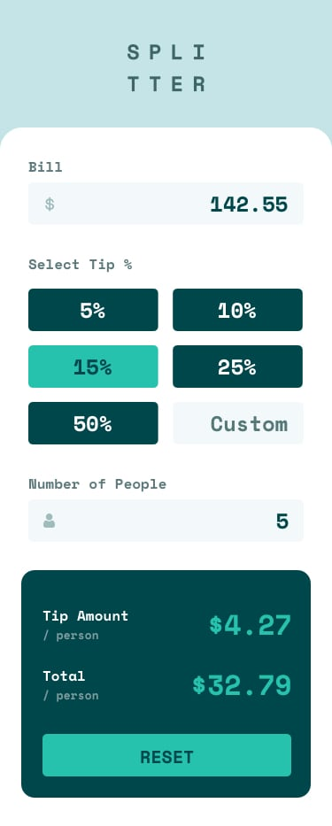
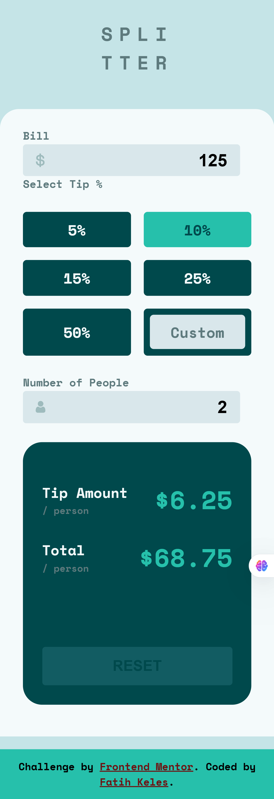

# Frontend Mentor - Tip Calculator App

This is my solution to the Tip Calculator App challenge on Frontend Mentor.

## Overview

### Design vs My Solution

| Original Design | My Solution |
|---|---|
|  |  |
<!-- |  |  | -->

## Links

- Live Site: 
- Repository: https://github.com/tilchi/frontend-mentor/tree/main/tip-calculator-app

## Built with

- HTML5
- CSS
- Vanilla JavaScript
